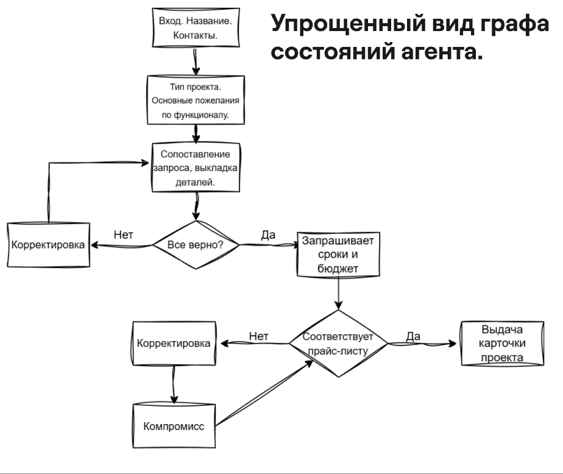

# Проект ии-агента, узнающего у клиента информацию по заказу, в рамках соревнования "Код успеха".

> **Функционал**  
> - Собирает с клиента данные по проекту.
> - Руководствуется прайс-листом компании.
> - Старается решать возникающие конфликтные ситуации.

## Пример работы

TODO

## Как работает приложение

- Приложение работает на основе графа состояний, описанного через LangChain.
- У каждого пользователя - свое состояние графа.
- Состояние графа, грубо говоря - этап диалога.
- Принятие решений в диалоге происходит также в графе так, как это описано на схеме.
- Получение csv с прайс-листами происходит при помощи предоставления ИИ инструментария на определенных этапах графа.